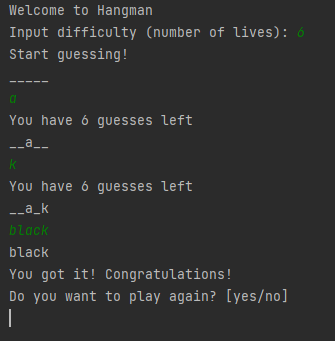

# Hangman.py
Super simple hangman game made in Python includes about 2500 unique words in the ``words.json`` file.
If you don't want to use the ``words.json`` file, then you can enable:
```python3
use_api = True
```
in the script, which will then pull words from [this api](https://github.com/RazorSh4rk/random-word-api). The only difference between the two is the API will have more words,
but that also means the words will be more random and "unknown", whilst the words in the ``words.json`` file are more common.

# Usage
Running the game is as simple as running the ``hangman.py`` script
```bash
python hangman.py
```
Once you run the script, you get to choose how many lives you have, and then you start guessing! You can also guess
the entire word if you think you know it.


